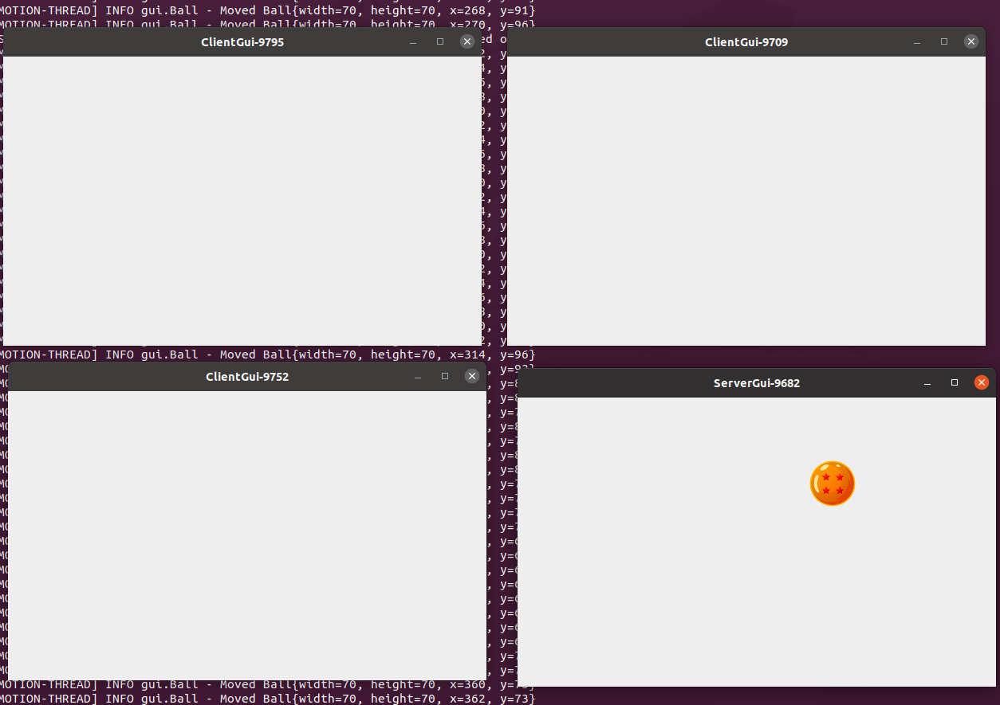
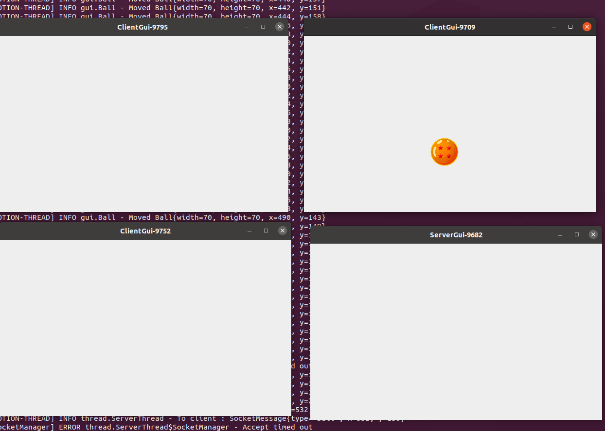
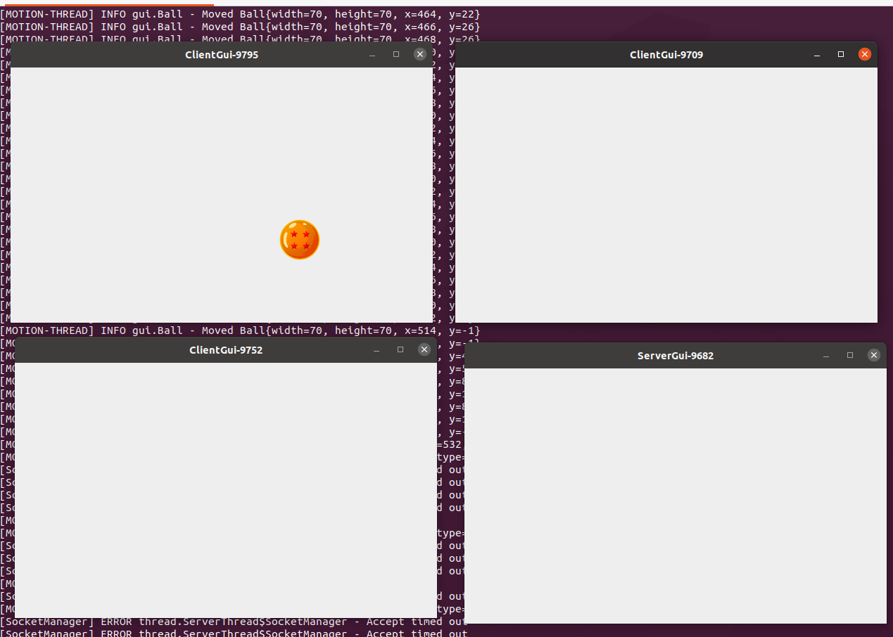

# Bouncing-ball is hobby project with gui ,where images are bouncing around.

Server-client architecture using socket & swing.

# About images in project :

I don't own/claim images. Images are downloaded for free from https://www.pngegg.com/.
Check https://www.pngegg.com/ for
cool images.

# Screenshots:

